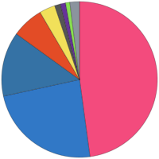

# Hi, I'm Jeff 👋

Senior software and data workflow developer with **24+ years of experience** building business systems, data platforms, internal tools, APIs, automation, and AI-supported applications.

<!-- LANGUAGES:START -->
<table align="center">
<tr>
<td></td>
<td>
<table>
<tr><th></th><th align="left">Language</th><th align="right">Share</th></tr>
<tr><td></td><td>C++</td><td align="right">64.1%</td></tr>
<tr><td></td><td>Python</td><td align="right">17.7%</td></tr>
<tr><td></td><td>HTML</td><td align="right">8.8%</td></tr>
<tr><td></td><td>JavaScript</td><td align="right">3.0%</td></tr>
<tr><td></td><td>C</td><td align="right">1.6%</td></tr>
<tr><td></td><td>TypeScript</td><td align="right">1.6%</td></tr>
<tr><td></td><td>Kotlin</td><td align="right">1.1%</td></tr>
<tr><td></td><td>Jupyter Notebook</td><td align="right">0.8%</td></tr>
<tr><td></td><td>Other</td><td align="right">1.1%</td></tr>
</table>
</td>
</tr>
</table>

Most used languages across my public repositories, by code size · updated daily

<!-- LANGUAGES:END -->

## Current Focus

Currently developing **RAG Railway**, a document-processing and retrieval platform using PostgreSQL/pgvector, semantic summaries, source-linked extraction, REST APIs, durable task execution, layered memory, and distributed worker processing.

I lead complex projects while remaining hands-on with architecture and implementation, with a focus on **reliable, maintainable systems that preserve source evidence, reuse completed work, and control AI processing costs**.

## Selected Past Work

Most of my work is private, so these are short summaries with no code or client data.

- **[NodeRAG](https://github.com/jeffvan302/NodeRAG-Releases)** · *2026* · Lightweight, private document search and chat (RAG) system that installs as a Synology NAS package, built as a foundation designed to grow.
- **Case management and reporting platform** · *2000–2020* · Maintained for 20 years; wrote about 60% of the original VB6 application, later adding a .NET reporting service and SQL Server CLR logic.
- **Face recognition CLI** · *2026* · Python and InsightFace: enrollment with outlier rejection, matching, and grouping of unknown faces.
- **YOLOv8 toolkit for .NET** · *2024–2025* · C# ONNX inference library plus tools for synthetic training images and dataset export.
- For more projects, [click here](https://github.com/jeffvan302/jeffvan302/blob/main/PAST_WORK.md).

## Tech

`C#` · `C++` · `C` · `Python` · `SQL` · `JavaScript` · `VB.NET` · `.NET` · `SQL Server` · `PostgreSQL` · `pgvector` · `OpenAI` · `Ollama` · `PyTorch` · `ONNX Runtime` · `Whisper` · `REST APIs` · `Railway` · `Supabase` · `Docker`
